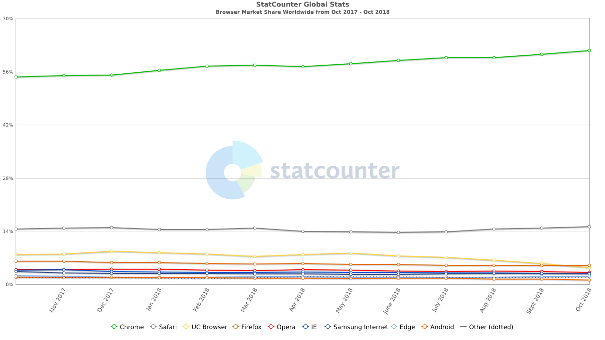

# JavaScript学习笔记

## JavaScript 组成：
* ECMAScript：由ECMA-262定义，提供JavaScript的核心语法
* DOM：提供访问和操作网页内容的方法和接口
* BOM：提供与浏览器交互的方法和接口，通过 BOM 可以控制浏览器显示的页面以外的部分

## 目前五个主要浏览器：IE、FireFox、Chrome、Safari和Opera占比查看[网站](http://gs.statcounter.com/)
<div align=center>

</div>

ECMAScript 中的一切（变量、函数名、操作符）都区分大小写

JavaScript 是松散语言，每个变量仅仅是一个用于保存值的占位符而已

未经初始化的变量会保存一个特殊值 —— undefined

在函数中未使用 ”var“ 定义的变量（极不推荐）和在函数体外定义的变量是全局变量，全局变量知道JS脚本运行结束才会被销毁，回收内存；在函数体内使用 “var” 定义的
变量是局部变量，局部变量在函数结束调用就会被销毁，回收其内存

数据类型：
* 基本数据类型 - Undefined、Null、Boolean、Number、String
* 复杂数据类型 - Object

ECMAScript 不支持创建自定义类型，所以 JavaScript 的所有值最终都是以上几种之一

Null - 只有一个值null，表示一个空对象指针
```
alert(typeof null)    //"object"
alert(null == undefined)    //"true"
```

ECMAScript 对象类型
* 本地对象 - native object - 独立于宿主环境的 ECMAScript 实现提供的对象
  * Object
  * Function
  * Array
  * String
  * Boolean
  * Number
  * Date
  * RegExp
  * Error
  * EvalError
  * RangeError
  * ReferenceError
  * SyntaxError
  * TypeError
  * URIError
* 内置对象 - built-in object - 由 ECMAScript 实现提供的、独立于宿主环境的所有对象，在 ECMAScript 程序开始执行时出现
> ECMA-262 只定义了两个内置对象，即 Global 和 Math 
* 宿主对象 - host object - 由 ECMAScript 实现的宿主环境提供的对象，所有 BOM 和 DOM 对象都是宿主对象

ECMAScript 作用域是按函数划分的，不同于 C/C++、Java语言是按块划分的

switch 值是使用全等 === 比较的

ECMAScript 函数参入的参数会在内部用一个数组表示，所以参数的类型和数量不限。在编写函数体时可直接通过 arguments 对象来访问参数数组，比如传入的第一个实参对应
arguments[0]，arguments的值永远与对应的命名参数的值保持一致

ECMAScript 函数不能重载，即函数名出现重复时，后定义的函数会遮挡先定义的函数

ECMAScript 的5种基本数据类型操作前会将值先复制一份，再对复制的值进行操作，值传递；对象操作是直接操作引用，即对象的指针操作

