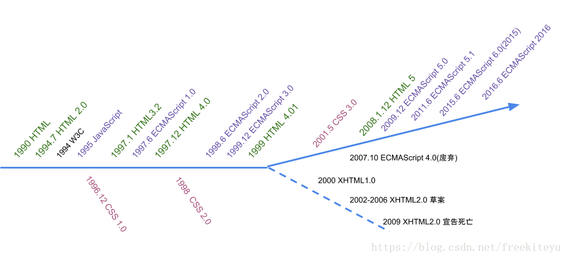
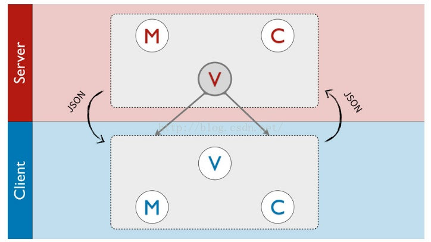
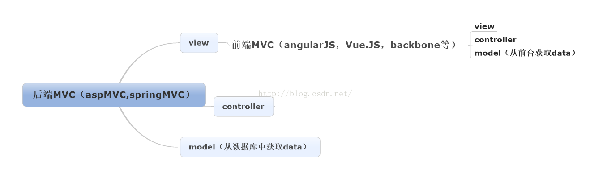

# 前端发展简史

## 什么是前端
* 前端 (front-end)：针对浏览器的开发，代码在浏览器运行
* 后端 (back-end)：针对服务器的开发，代码在服务器运行

## 前端使用的语言发展

 Html、CSS、JavaScript历史

* 1989 - HTML 诞生
* 1995 - JavaScript 诞生
* 1996 - CSS 诞生
* 2005 - Ruby on Rails 诞生，掀起敏捷时代
* 2006 - jQuery 诞生
* 2008 - 前端 MVC 诞生
* 2010 - 前端技术大爆炸

> Backbone.js 可以自由构建设计模式的框架 
Angular.js MVVM 框架 
ember.js MVVM 框架 
Grunt 自动化 
node.js 后端开发 
gulp 自动化 
require.js 依赖解决 
common.js 依赖解决 

* 2013 - React.js 诞生
> 为了解决超大 Web 程序的页面架构，交互逻辑，数据状态等问题，React.js 诞生了，React 是一整套的程序设计模式的统称

## 网页设计模式发展历史
### 前后端不分的时代
1. 后端收到浏览器的请求
2. 生成静态页面
3. 发送到浏览器

### 后端 MVC 的开发模式
前端采用 MVC 的 View模式
* Model（模型层）：提供/保存数据
* Controller（控制层）：数据处理，实现业务逻辑
* View（视图层）：展示数据，提供用户界面
java和dotNET框架都是在后台的，如ssh中的struct、springMVC，和ASP.MVC都是属于后端 MVC 模式

## Ajax: AsynchronousJavascript+XML (异步传输+js+xml)
>所谓异步，在这里简单地解释就是：向服务器发送请求的时候，我们不必等待结果，而是可以同时做其他的事情，等到有了结果我们可以再来处理这个事

* 只要是JS调用异步通讯组件并使用格式化的数据来更新web页面上的内容或操作过程，那么我们用的方法就可算是AJAX
* 由多种技术集合而成，使用Ajax技术不必刷新整个页面，只需对页面的局部进行更新，可以节省网络带宽，提高页面的加载速度，从而缩短用户等待时间，改善用户体验

Ajax 技术诞生，改变了一切。
应用：
* 2004年：Gmail
* 2005年：Google 地图
前端不再是后端的模板，可以独立得到各种数据。

## Web 2.0

Ajax 技术促成了 Web 2.0 的诞生，Ajax是Web2.0技术的核心
* Web 1.0：静态网页，纯内容展示
* Web 2.0：动态网页，富交互，前端数据处理

## 前端 MVC 框架

前端通过 Ajax 得到数据，因此也有了处理数据的需求。

前端代码变得也需要保存数据、处理数据、生成视图，这导致了前端 MVC 框架的诞生。

前端的 MVC 框架其实就是后端 MVC 框架中的 View

## SPA —— 前端 MVC 模式衍生
 SPA: Single-page application (单页应用的架构)

### 前端 MVVM 模式
 MVVM（Model-View-ViewModel）最早由微软提出。ViewModel指 "Model of View"——视图的模型
* Model
* View
* View-Model：简化的 Controller，唯一作用就是为 View 提供处理好的数据，不含其他逻辑。
本质：view 绑定 view-model，视图与数据模型强耦合。数据的变化实时反映在 view 上，不需要手动处理。

### 前端 MPV 模式
* MVP（Model-View-Presenter）是MVC模式的改良，由IBM的子公司Taligent提出。和MVC的相同之处在于：Controller/Presenter负责业务逻辑，Model管理数据，View负责显示
* 在MVC里，View是可以直接访问Model的，但MVP中的View并不能直接使用Model，而是通过为Presenter提供接口，让Presenter去更新Model，再通过观察者模式更新View
* 与MVC相比，MVP模式通过解耦View和Model，完全分离视图和模型使职责划分更加清晰；由于View不依赖Model，可以将View抽离出来做成组件，它只需要提供一系列接口提供给上层操作。
