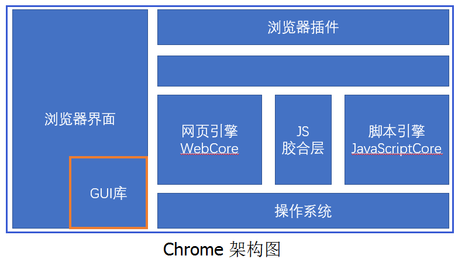

# 浏览器架构简析

## 浏览器的主要组件

1. 用户界面 (User Interface) - 包括地址栏、前进/后退按钮、书签菜单等。除了浏览器主窗口显示的您请求的页面外，其他显示的各个部分都属于用户界面
2. 浏览器引擎 (Browser engine) - 在用户界面和渲染引擎之间传送指令
3. 渲染引擎 (Rendering engine) - 负责显示请求的内容，如果请求的内容是 HTML，它就负责解析 HTML 和 CSS 内容，并将解析后的内容显示在屏幕上
4. 网络 (Networking) - 用于网络调用，比如 HTTP 请求，其接口与平台无关，并为所有平台提供底层实现
5. 用户界面后端 (UI Backend) - 用于绘制基本的窗口小部件，比如组合框和窗口，其公开了与平台无关的通用接口，而在底层使用操作系统的用户界面方法
6. JavaScript 解释器 (JavaScript Interpreter) - 用于解析和执行 JavaScript 代码
7. 数据存储 (Date Persistence) - 这是持久层,浏览器需要在硬盘上保存各种数据，例如 Cookie，新的 HTML 规范 (HTML5) 定义了“网络数据库”，这是一个完整（但是轻便）的浏览器内数据库

* 默认情况下，渲染引擎可显示 HTML 和 XML 文档与图片。通过插件（或浏览器扩展脚本），还可以显示其他类型的内容；例如，使用 PDF 查看器插件就能显示 PDF 文档
* Chrome 浏览器通常会为每一个标签页和扩展插件开一个进程

